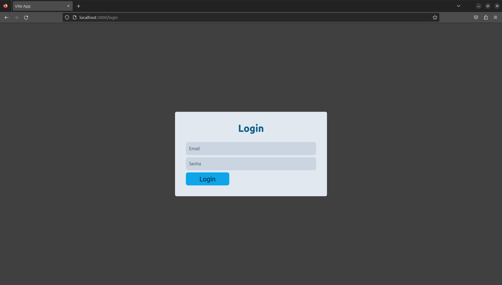

# TO-DO App

### Demononstração em video
[](https://youtu.be/PnlITiVqcgM "TO-DO App")

### Dependências
``` 
Ruby 3.2.2
Rails 7.0.5
Node 18.13.0
```
---
### Instalação
```Bash
git clone https://github.com/jvlp/todo-app
cd todo-app
bundle install
cd fronend
yarn # ou npm -i
```

```Ruby
# No arquivo todo-app/config/database.yml
# altere as linhas 16 e 17 com as suas credenciais de desenvolvimento do mysql
  username: jvlp
  password: 123
```

```Bash
# Na pasta todo-app
rake db:reset # criar e popular as tabelas
```

---
### Execução
#### API
```Bash
# Na pasta todo-app
rails s
```
#### Frontend
```Bash
# Na pasta todo-app/frontend
yarn dev
```
